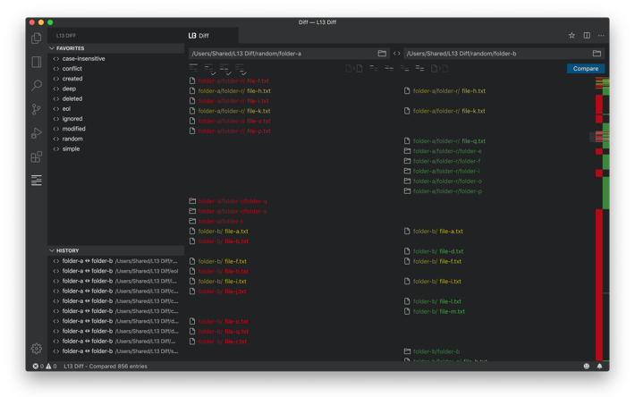
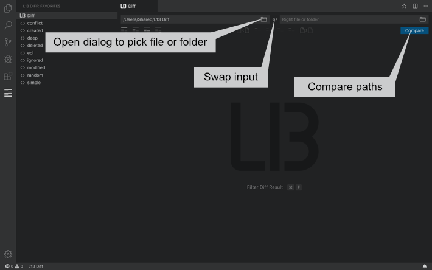
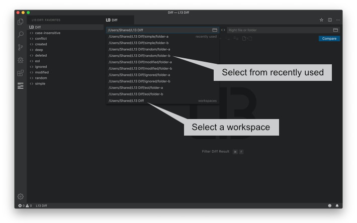
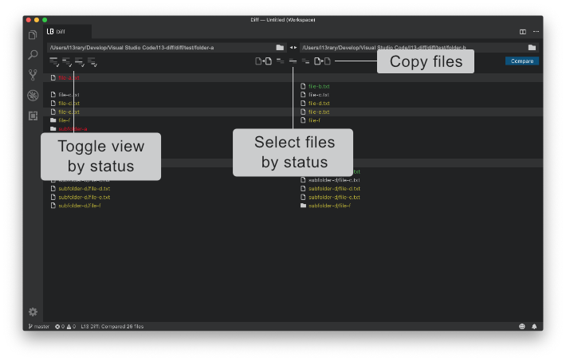

# L13 Diff

Compare two folders in Visual Studio Code.

## What's new in L13 Diff 0.17.0

- Added setting `l13Diff.ignoreEndOfLine`. If true different line endings (CR/LF) in text files will be ignored. Default value is `false`.
- Added `L13 Diff` as first favorite to open diff panel with mouse.
- Added dimmed dirnames in list view.
- Added color for conflicts if file has been changed to folder or vice versa.

## Features

* Supports a history for recently used files and folders.
* Auto detects current workspaces.
* Select folders with the context menu in the VS Code Explorer or the open dialog.
* Drag'n Drop files and folders from the VS Code Explorer or from the Finder/Explorer into the input fields.
* Copy files and folders from left to right or vi­ce ver­sa.
* Select all files and folders by status.
* Toggle the visiblity of list items by status.
* Double click an file item in the list to open the diff or the file.
* Mouse and keyboard support for selecting items in the list.
* Search for pathnames to filter diff result.
* Save your favorite diffs and start a compare immediately.
* Supports predefined variables for dynamic pathnames.

Select a folder with the dialog, swap the paths and compare two files or folders.

Select from recently used, current workspaces or drag'n drop folders into the input fields.

Toggle the view, select files by status or copy files from left to right or vice versa.

## Available Commands

* `L13 Diff` - Open the diff panel.
* `Open in L13 Diff` - Open the diff panel with selected files or folders by dialog or context menu.
* `L13 Diff: Clear History` - Clear the history of recently used files and folders.
* `L13 Diff: Delete all favorites` - Delete all favorites.

## Available Settings

* `l13Diff.maxRecentlyUsed` - Defines the max length of recently used entries in the menu.
* `l13Diff.openToSide` - Set true if a diff or file should open to the side.
* `l13Diff.ignore` - A list of files and folders which should be ignored. Supports * for names.
* `l13Diff.openFavoriteAndCompare` - Set true if a click on a favorite diff should start a comparison.

## Predefined Variables

* `${workspaceFolder}` - Use the current workspace folder for the diff e.g. '${workspaceFolder}/path/to/folder'
* `${workspaceFolder:INDEX}` - Use a specific workspace folder by index for the diff e.g. '${workspaceFolder:1}/path/to/folder'
* `${workspaceFolderBasename:NAME}` - Use a specific workspace folder by name for the diff e.g. '${workspaceFolderBasename:workspace-a}/path/to/folder'. If a folder has a closing brace '}' in its name, then the char has to be escaped e.g. '${workspaceFolderBasename:name-{1\\}}'.

## Global Keyboard Shortcuts

macOS

* `Cmd + L Cmd + L` - Open the diff panel.
* `Cmd + D` - Add the current paths to favorites. Diff panel has to be active editor.

Windows / Linux

* `Ctrl + L Ctrl + L` - Open the diff panel.
* `Ctrl + D` - Add the current paths to favorites. Diff panel has to be active editor.

If the key bindings don't work, please check `Preferences -> Keyboard Shortcuts`.

## Input/Menu Mouse/Keyboard Shortcuts

* `Click` - Select a path in the menu.
* `ArrowUp/ArrowDown` - Move the cursor to the previous/next list item in menu.
* `Enter` - If the menu is visible, the selected path will be filled in, otherwise a compare starts.

## List Mouse/Keyboard Shortcuts

All platforms

* `Click` - Select a file or folder in the list view.
* `Shift + Click` - Add files and folders from the last selected item to the current selected item in the list view.
* `Double Click` - Open a diff or file.
* `Alt + Double Click` - Open diff or file to side.
* `Enter` - Open diff or file.
* `Ctrl + Enter` - Open diff or file to side.
* `Escape` - Unselect all items in the list view.

macOS

* `Cmd + Click` - Add or remove a file or folder to or from the current selection.
* `Cmd + A` - Select all items in the list view.
* `ArrowUp/ArrowDown` - Move the cursor to the previous/next list item.
* `Alt + ArrowUp/ArrowDown` - Move the cursor to the start/end of list view.
* `Shift + ArrowUp/ArrowDown` - Add the previous/next list item to the selection.
* `Shift + Alt + ArrowUp/ArrowDown` - Add all list items until start/end of the list view to the selection.
* `Home/End` - Scroll to the start/end of the list view.
* `PageUp/PageDown` - Scroll to the previous/next page of the list view.

Windows / Linux

* `Ctrl + Click` - Add or remove a file or folder to or from the current selection.
* `Ctrl + A` - Select all items in the list view.
* `ArrowUp/ArrowDown` - Move the cursor to the previous/next list item.
* `Shift + ArrowUp/ArrowDown` - Add the previous/next list item to the selection.
* `Home/End` - Move the cursor to the start/end of list view.
* `Shift + Home/End` - Add all list items until start/end of the list view to the selection.
* `PageUp/PageDown` - Move the cursor to the start/end of the previous/next page of the list view.
* `Shift + PageUp/PageDown` - Add all list items of the previous/next page to the selection.

## Search Widget Keyboard Shortcuts

All platforms

* `Escape` - Hide search widget.

macOS

* `Cmd + F` - Show search widget.
* `Cmd + Alt + C` - Toggle match case.
* `Cmd + Alt + R` - Toggle use regular expression.

Windows / Linux

* `Ctrl + F` - Show search widget.
* `Alt + C` - Toggle match case.
* `Alt + R` - Toggle use regular expression.

## Favorites Explorer

* `Click` - Open a favorite diff. If `l13Diff.openFavoriteAndCompare` is true the comparison starts immediately.

Context menu

* `Open` - Open the favorite diff without starting a comparison immediately. Ignores `l13Diff.openFavoriteAndCompare`.
* `Open & Compare` - Open the favorite diff and start a comparison immediately. Ignores `l13Diff.openFavoriteAndCompare`.
* `Rename` - Change the name of the favorite.
* `Delete` - Delete the favorite diff.