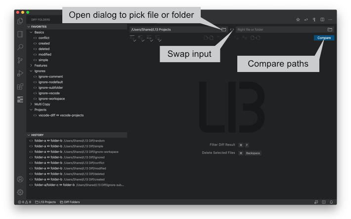

# L13 Diff

Compare two folders in Visual Studio Code.

## Features

* Supports a history for recently used folders.
* Auto detects current workspaces.
* Select folders with the context menu in the VS Code Explorer or the open dialog.
* Drag'n Drop folders from the VS Code Explorer or from the Finder/Explorer into the editor.
* Copy files from left to right or vi­ce ver­sa.
* Select all files and folders by status.
* Toggle the view by status.

Select a folder with the dialog, swap the paths and compare two files or folders.

Select from recently used, current workspaces or drag'n drop folders into the input fields.

Toggle the view, select files by status or copy files from left to right or vice versa.

## Available Commands

* `L13 Diff` - Open the diff panel
* `Open in L13 Diff` - Open the diff panel with selected files or folders by dialog or context menu.
* `L13 Diff: Clear History` - Clear the history of recently used files and folders.

## Keyboard Shortcuts

macOS

* `meta+l meta+l` - L13 Diff

Windows / Linux

* `ctrl+l ctrl+l` - L13 Diff

If the key bindings don't work, please check `Preferences -> Keyboard Shortcuts`.