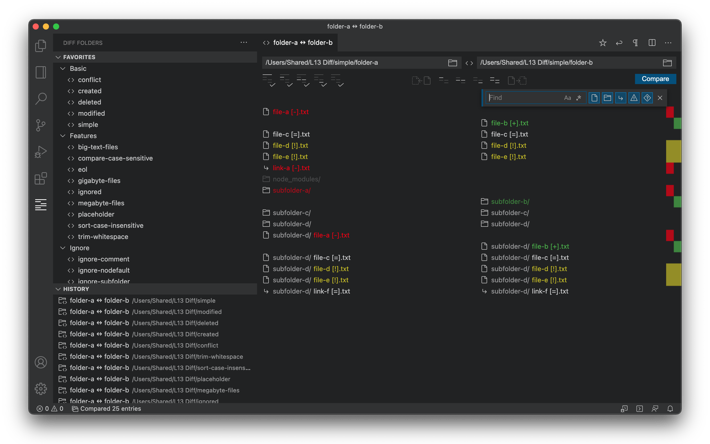
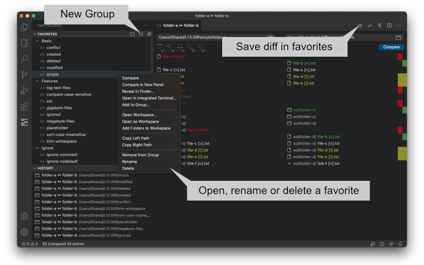
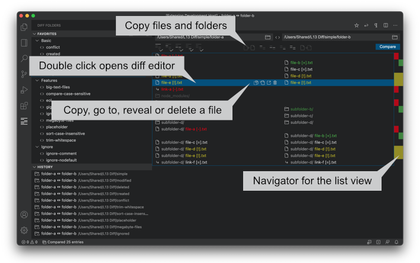
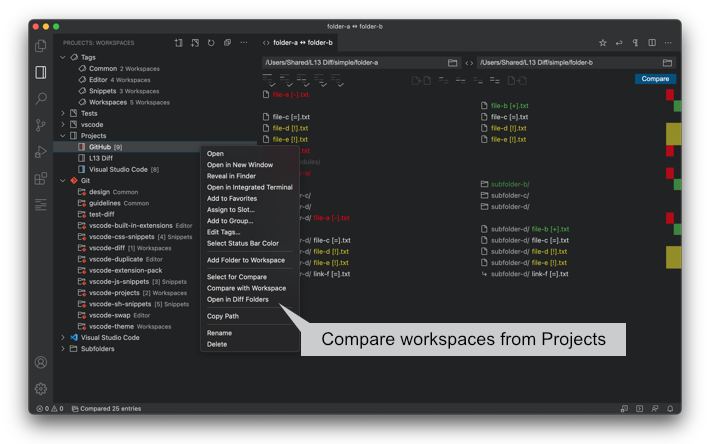

# Diff Folders (L13 Diff)

Compare two folders in Visual Studio Code.

## What's new in Diff Folders 0.28.0

- Added `l13Diff.exclude` which replaces `l13Diff.ignore` (depricated).
- Added `l13Diff.useCaseSensitiveFileName`.
- Added path segments `**` to `l13Diff.exclude`.
- Double click on folders in list view opens new Diff Folders panel. Works also with ignored files.

## Index

1. [Features](#features)
1. [Available Commands](#available-commands)
1. [Available Settings](#available-settings)
1. [Predefined Variables](#predefined-variables)
1. [Mouse and Keyboard Shortcuts](#mouse-and-keyboard-shortcuts)
1. [Recommended Extensions](#recommended-extensions)

## Features

* Supports extension [Projects](https://marketplace.visualstudio.com/items?itemName=L13RARY.l13-projects)
* Supports a history for recently used files, folders and previous comparisons.
* Auto detects current workspaces.
* Select folders with the context menu in the VS Code Explorer or the open dialog.
* Drag'n drop files and folders from the Finder/Explorer into the input fields.
* Copy files and folders from left to right or vi­ce ver­sa. Symbolic links on Windows can only be copied if Visual Studio Code runs in administrator mode otherwise an error occurs.
* Select all files, folders and symlinks by status.
* Toggle the visiblity of list items by status.
* Double click a file item in the list to open the diff or the file.
* Mouse and keyboard support for selecting items in the list view.
* Search for pathnames to filter diff result.
* Save your favorite diffs and start a comparison immediately.
* Use predefined variables for dynamic pathnames.
* Provides logging and stats for the current diff.
* Get a quick overview with the navigator of the current diff.
* Delete files and folders in the list view.
* Provides a context menu for list items to copy, delete or reveal a file.
* Ignores line endings in text files for a comparison.
* Ignores leading and trailing whitespace in text files.
* Auto updates the list view if a file has been saved in the same window as the comparison.
* Open multiple panels by click on the icon in the favorites view.
* Copy the same files from the same location to multiple folders at once.

### Basics

### Favorites

### Search, filter or select

### List and navigator

### Logging and stats

### Supports the extension [Projects](https://marketplace.visualstudio.com/items?itemName=L13RARY.l13-projects)

## Available Commands

* `Diff Folders` - Open the diff panel.
* `Open in Diff Folders` - Open the diff panel with selected files or folders in the Visual Studio Code Explorer by dialog or context menu.
* `Diff Folders: Clear History` - Clear the history of recently used files, folders and previous comparisons.
* `Diff Folders: Delete All Favorites` - Delete all favorites.

## Available Settings

* `l13Diff.maxRecentlyUsed` - Defines the max length of recently used entries in the menu.
* `l13Diff.openToSide` - Set true if a diff or file should open to the side.
* `l13Diff.useCaseSensitiveFileName` - If true filenames and glob patterns for `l13Diff.exclude` are case sensitive otherwise they are case insensitive.
* `l13Diff.exclude` - A list of files and folders which should be ignored. If the folder for a comparison or one of its parent folders contains the `.vscode/settings.json` file and is not the current workspace folder, the file will be automatically detected and the values of the property will also be used for the comparison. If the folder is part of the current workspace, the workspace settings will be used instead of the local settings. Supports the following glob patterns:
	* `*` matches zero or more characters in a path segment e.g. `*.txt`.
	* `?` matches on one character in a path segment.
	* `**` matches any number of path segments including none e.g. `**/node_modules`.
* `l13Diff.openFavoriteAndCompare` - Set true if a click on a favorite diff should start a comparison.
* `l13Diff.confirmCopy` - If false confirm dialog for copying files does not appear.
* `l13Diff.confirmDelete` - If false confirm dialog for deleting files does not appear. Is not used if you have to decide which side have to be deleted.
* `l13Diff.initialFavoriteGroupState` - Set the initial state of a group.
	* `Remember` - (default) Remember the collpased and expanded state of each group.
	* `Collapsed` - Show all groups collapsed at start.
	* `Expanded` - Show all groups expanded at start.
* `l13Diff.ignoreEndOfLine` [1] - Set true if a comparison for text files should ignore line endings (CR/LF).
* `l13Diff.ignoreTrimWhitespace` [1] - Ignores leading and trailing whitespace in text files.
	* `default` - (default) Uses the value of `diffEditor.ignoreTrimWhitespace`.
	* `on` - Ignores leading and trailing whitespace for a comparison in a text file.
	* `off` - Does not ignore leading and trailing whitespace for a comparison in a text file.

[1] Supports only ASCII based and UTF-16 BE/LE encoded files. The text file detection uses the extension name definitions of all installed extensions or the property `files.associations` in the user settings. If a file isn't detected as a text file the extension name has to be added to `files.associations` like `"*.extname": "language"`.

## Predefined Variables

* `${workspaceFolder}` - Use the current workspace folder for the diff e.g. '${workspaceFolder}/path/to/folder'
* `${workspaceFolder:NAME}` - Use a specific workspace folder by name for the diff e.g. '${workspaceFolder:workspace-a}/path/to/folder'. If a folder has a closing brace '}' in its name, then the char has to be escaped e.g. '${workspaceFolder:name-{1\\}}'.

## Mouse and Keyboard Shortcuts

### Global

#### macOS

* `Cmd + L Cmd + L` - Open the diff panel.
* `Cmd + D` - Add the current paths to favorites. Diff panel has to be active editor.
* `Cmd + L Cmd + O` - Open the output channel. Provides logging and stats for the current diff.
* `Cmd + L Cmd + F` - Open favorites explorer.

#### Windows / Linux

* `Ctrl + L Ctrl + L` - Open the diff panel.
* `Ctrl + D` - Add the current paths to favorites. Diff panel has to be active editor.
* `Ctrl + L Ctrl + F` - Open favorites explorer.

#### Windows

* `Ctrl + L Ctrl + O` - Open the output channel. Provides logging and stats for the current diff.

If the key bindings don't work, please check `Preferences -> Keyboard Shortcuts`.

### Input/Menu

* `Click` - Select a path in the menu.
* `ArrowUp/ArrowDown` - Move the cursor to the previous/next list item in the menu.
* `Enter` - If the menu is visible, the selected path will be filled in, otherwise a comparison starts.
* `Escape` - Hide the menu if visible.

### Swap Button

#### All platforms

* `Click` - Swaps just the values of the input fields.
* `Alt + Click` - Swaps the values of the input fields and the diff result.

#### macOS

* `Cmd + S` - Same as `Click`.
* `Alt + Cmd + S` - Same as `Alt + Click`.

#### Windows / Linux

* `Ctrl + S` - Same as `Click`.
* `Alt + Ctrl + S` - Same as `Alt + Click`.

### Compare Button

#### All platforms

* `Click` - Start a comparison.
* `Alt + Click` - Start a comparison in all diff panels.

#### macOS

* `Cmd + C` - Same as `Click`.
* `Alt + Cmd + C` - Same as `Alt + Click`.

#### Windows / Linux

* `Ctrl + C` - Same as `Click`.
* `Alt + Ctrl + C` - Same as `Alt + Click`.

### Actions

#### Copy files to the left/right folder.

* `Click` - Copy all selected files to the other folder.
* `Alt + Click` - Copy all selected files in one diff panel in all other diff panels from one source to the other folders at once. Open two or more diff panels and make a comparison with the same folder on the same side. Select all the files you want to copy in one diff panel and press the button with `Alt + Click` to copy all the files from the same source to all other folders, too.

### List

#### All platforms

* `Click` - Select a file or folder in the list view.
* `Shift + Click` - Add files and folders from the last selected item to the current selected item in the list view.
* `Double Click` - Open a diff or file.
* `Alt + Double Click` - Open diff or file to side.
* `Enter` - Same as `Double Click`.
* `Ctrl + Enter` - Same as `Alt + Double Click`.
* `Escape` - Unselect all items in the list view.

#### macOS

* `Cmd + Click` - Add or remove a file or folder to or from the current selection.
* `Cmd + A` - Select all items in the list view.
* `ArrowUp/ArrowDown` - Move the cursor to the previous/next list item.
* `Alt + ArrowUp/ArrowDown` - Move the cursor to the start/end of list view.
* `Shift + ArrowUp/ArrowDown` - Add the previous/next list item to the selection.
* `Shift + Alt + ArrowUp/ArrowDown` - Add all list items until start/end of the list view to the selection.
* `Home/End` - Scroll to the start/end of the list view.
* `PageUp/PageDown` - Scroll to the previous/next page of the list view.
* `Cmd + Backspace` - Delete selected files and folders. Opens a dialog to choose which files (left, right or all) should be deleted.

#### Windows / Linux

* `Ctrl + Click` - Add or remove a file or folder to or from the current selection.
* `Ctrl + A` - Select all items in the list view.
* `ArrowUp/ArrowDown` - Move the cursor to the previous/next list item.
* `Shift + ArrowUp/ArrowDown` - Add the previous/next list item to the selection.
* `Home/End` - Move the cursor to the start/end of list view.
* `Shift + Home/End` - Add all list items until start/end of the list view to the selection.
* `PageUp/PageDown` - Move the cursor to the start/end of the previous/next page of the list view.
* `Shift + PageUp/PageDown` - Add all list items of the previous/next page to the selection.
* `Delete` - Delete selected files and folders. Opens a dialog to choose which files (left, right or all) should be deleted.

### List Context Menu

#### All platforms

* `Copy` - If one or more list items are selected and the icon will be clicked on one of those items all selected files will be copied to the other folder. If the icon will be clicked and the list item isn't seleted only the current file will be copied. This button supports copying files to multiple folders at once with `Alt + Click`, too. Please read the description for `Copy files to the left/right folder` to see how it works.
* `Delete` - If one or more list items are selected and the icon will be clicked on one of those items all selected files will be deleted. If the icon will be clicked and the list item isn't seleted only the current file will be deleted.

#### macOS

* `Reveal in Finder` - Shows the current file in the finder.

#### Windows

* `Reveal in Explorer` - Shows the current file in the explorer.

#### Linux

* `Open Containing Folder` - Shows the current file in the file manager.

### List Drag'n Drop

- `Drag'n Drop` - Drag a path in the list view to another path of the same type (file or symbolic link) and let it drop to open a diff with these two files. Paths can also be dropped into the input fields and the search widget.

### Search Widget

#### All platforms

* `Escape` - Hide search widget.

#### macOS

* `Cmd + F` - Show search widget.
* `Cmd + Alt + C` - Toggle match case.
* `Cmd + Alt + R` - Toggle use regular expression.

#### Windows / Linux

* `Ctrl + F` - Show search widget.
* `Alt + C` - Toggle match case.
* `Alt + R` - Toggle use regular expression.

### Favorites

* `Click` - Open a favorite diff. If `l13Diff.openFavoriteAndCompare` is true the comparison starts immediately.

#### Context Icons

* `Diff Folders` - Open a new panel.
* `New Group` - Add a new group.
* `Collapse All` - Collapse all groups.

#### Context Menu

* `Open` - Open the favorite diff without starting a comparison immediately. Ignores `l13Diff.openFavoriteAndCompare`.
* `Open & Compare` - Open the favorite diff and start a comparison immediately. Ignores `l13Diff.openFavoriteAndCompare`.
* `Add to Group` - Add a favorite diff to a group.
* `Remove` - Remove a favorite diff from a group.
* `Rename` - Change the name of a favorite or a group.
* `Delete` - Delete a favorite diff or a group. If you delete a group you can optionally delete all favorites in the group.

### History

* `Click` - Open the previous comparison and start a comparison immediately.

#### Context Icons

* `Diff Folders: Clear History` - Clear the history of recently used files, folders and previous comparisons.

#### Context Menu

* `Open` - Open the previous comparison without starting a comparison immediately.
* `Open & Compare` - Open the previous comparison and start a comparison immediately.
* `Delete` - Delete the previous comparison from the history.

### Statusbar

* `Click` - Open the output channel for logging and stats.

### Navigator

* `Click` - Drag'n drop the scrollbar thumb of the navigator to scroll the list or click elsewhere in the navigator and jump to this part of the list.

### Visual Studio Code Explorer

#### Context Menu

* `Select for Compare` - Select a folder for a comparison.
* `Compare with Selected` - Compare the folder with the selected one.
* `Compare Selected` - Compare the two selected folders.

### [Projects](https://marketplace.visualstudio.com/items?itemName=L13RARY.l13-projects)

#### Context Menu

* `Select for Compare` - Select a folder, repository or project for a comparison.
* `Compare with Selected` - Compare the folder, repository or project with the selected one.
* `Compare with Workspace` - Compare the folder, repository or project with the current workspace.
* `Open in Diff Folders` - Open the folder, repository or project in Diff Folders.

## Recommended Extensions

- [Projects](https://marketplace.visualstudio.com/items?itemName=L13RARY.l13-projects)
- [Extension Pack](https://marketplace.visualstudio.com/items?itemName=L13RARY.l13-extension-pack)